# 論文實作與延伸：Evolutionary Sampling Agent (ESA) for Expensive Problems

本專案實作了論文 *Evolutionary Sampling Agent for Expensive Problems*，並在此基礎上導入 Deep Q-Network (DQN)，以探討在複雜的地形特徵下，Agent 策略選擇的泛化能力與收斂表現。

## Requirements

- **NumPy**
- **scipy**
- **pandas**
- **torch**
- **matplotlib**

---

## 核心實作與延伸

### 1. 論文重現
在此階段，我們完整重現了原論文的架構：
- **代理模型**：引入 Radial Basis Function (RBF) 作為代理模型，透過先前數據建構代理模型來逼近真實的適應值評估 Fitness Evaluation。
- **採樣策略**：實作了針對 Expensive Problems 的 4 種演化採樣策略。
- **決策機制**：使用 Q-Learning (Q-Table) 作為 Agent 的大腦，根據當前地形特徵選擇最適合的採樣策略。

### 2. 進階延伸 (Deep Q-Network, DQN)
論文中使用的 Q-Learning 僅有有限的 8 個狀態，但 Expensive Problems 中的複雜程度往往不僅於此，因此我們導入DQN，試圖透過更進階的模型加快ESA的收斂速度。
#### 特徵定義
為了讓 DQN 的神經網路能精確感知地形的變化進而選出更適合的策略，我們最終選出了 8 個特徵作為輸入：

1. **s_1 是否進步**：數值 0 或 1，表示前一次的採樣策略是否成功找到更佳解
2. **s_2 空間多樣性**：計算近期數據 (設定數量與a2、a4的採樣數相近) 在各維度的標準差與全距比例 (std / range)。此特徵用以評估當前搜索空間的多樣性與收斂狀態。
3. **s_3 Local Skewness**：計算近期目標函數值 (Fitness) 的偏度。使用 `tanh` 函數將其壓縮至 `[-1, 1]` 的安全範圍。此特徵用於反映局部地形的對稱性與崎嶇程度，同時避免極端值導致梯度爆炸。
4. **s_4 預測誤差**：代理模型 (RBF) 的預測誤差 (MAPE)，讓 Agent 知道當前地形是否已被模型充分掌握。
5. **前次決策 (4D One-Hot)**：將前次使用的策略進行 One-Hot 編碼，提供 Agent 決策上參考。

*(註：我們亦實作了消融機制 Ablation Mode，用於分析各項地形特徵對決策成效的貢獻度。)*

#### 神經網路架構
底層採用 PyTorch 實作，網路架構如下：

- **神經網路 (MLP Structure)**：
  - **Input Layer**：接收上述的 8 維特徵。
  - **Hidden Layers**：包含兩層各 64 個節點的全連接層，hidden layers 中採用 `ReLU` 激勵函數。
  - **Output Layer**：輸出 4 維的 Q-value，對應 4 種演化採樣策略的預期回報。
- **RL 穩定機制**：
  - **Replay Buffer**：實作容量為 5000 的經驗回放池，透過隨機抽樣打破訓練資料的時間關聯性。
  - **Target Network**：採用雙網路架構，計算 Bellman Equation 目標值時切斷梯度，並定期同步權重，大幅降低訓練過程中的 Q 值震盪。
  - **Epsilon-Greedy 探索**：Epsilon 從 1.0 起始，以 0.995 的衰減率逐步收斂至最低 0.05，確保 Agent 在 Exploration 與 Exploitation 之間取得良好平衡。

---

## 實驗數據
### Q-Learning
| 論文數據 | 實驗結果 |
| :-----: | :--------: |
| Table2  | Table2  |
| Table3  | Table3  |

ESA各種收斂圖
| 函數 ＼ 維度 | 30D | 50D | 100D |
| :--- | :---: | :---: | :---: |
| **Ellipsoid** |  |  |  |
| **Rosenbrock** |  |  |  |
| **Griewank** |  |  |  |

單一採樣策略收斂圖
| 函數 ＼ 維度 | 30D | 50D | 100D |
| :--- | :---: | :---: | :---: |
| **Ellipsoid** |  |  |  |
| **Rosenbrock** |  |  |  |
| **Griewank** |  |  |  |

去一採樣策略收斂圖
| 函數 ＼ 維度 | 30D | 50D | 100D |
| :--- | :---: | :---: | :---: |
| **Ellipsoid** |  |  |  |
| **Rosenbrock** |  |  |  |
| **Griewank** |  |  |  |

### DQN
#### DQN 消融模式之數據

  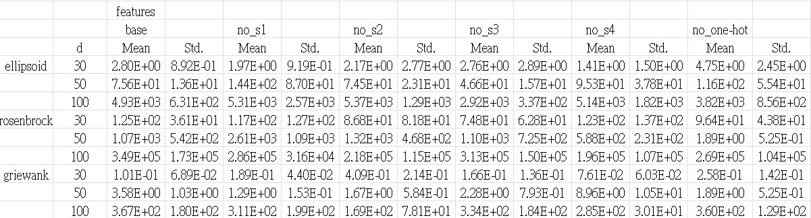

#### DQN 收斂數據

  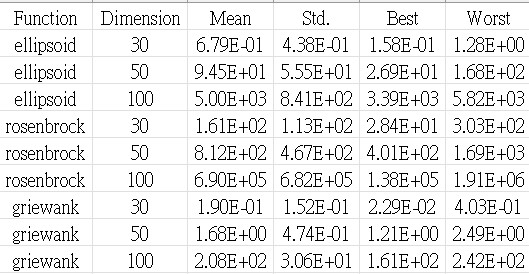

#### Q-Learning 與 DQN 收斂圖比較
| 函數 ＼ 維度 | 30D | 50D | 100D |
| :--- | :---: | :---: | :---: |
| **Ellipsoid** | 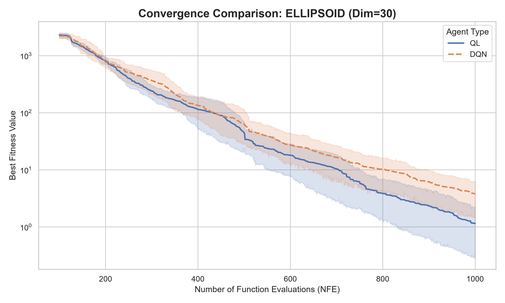 | 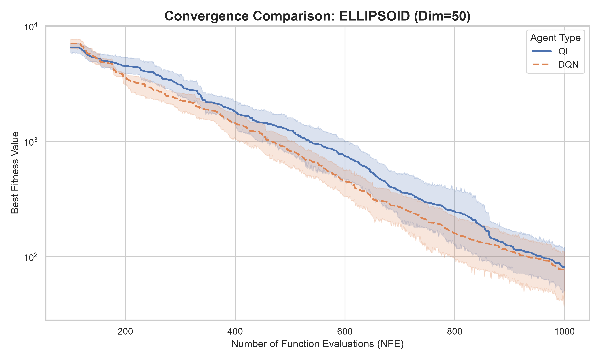 | 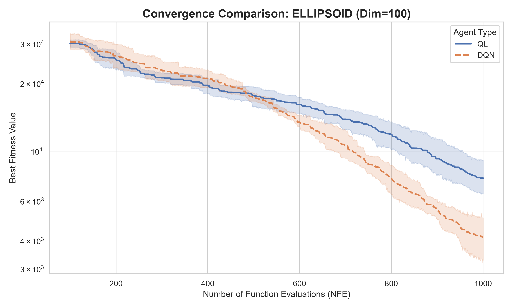 |
| **Rosenbrock** | 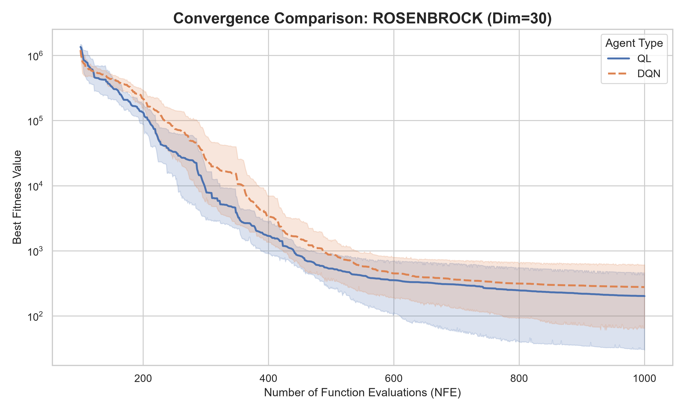 | 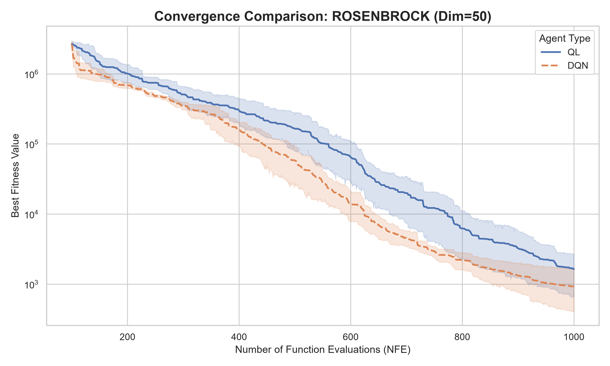 | 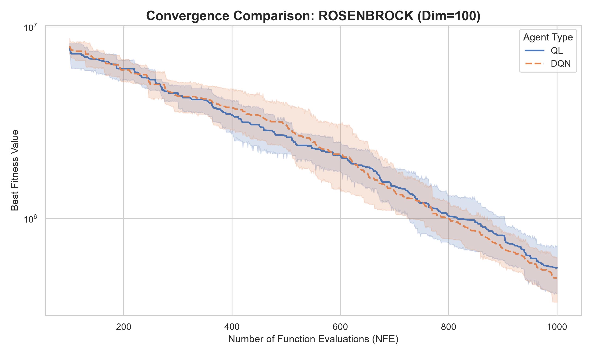 |
| **Griewank** | 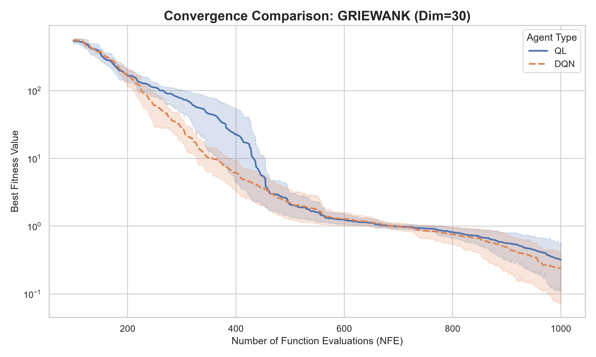 | 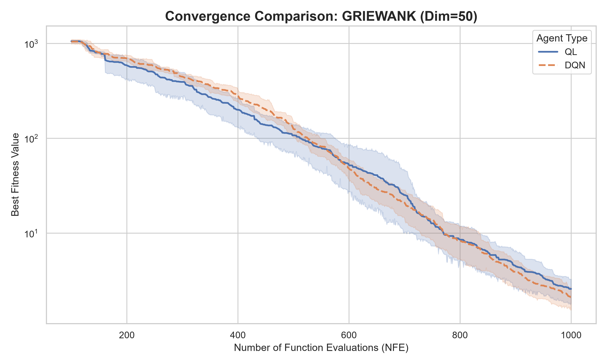 | 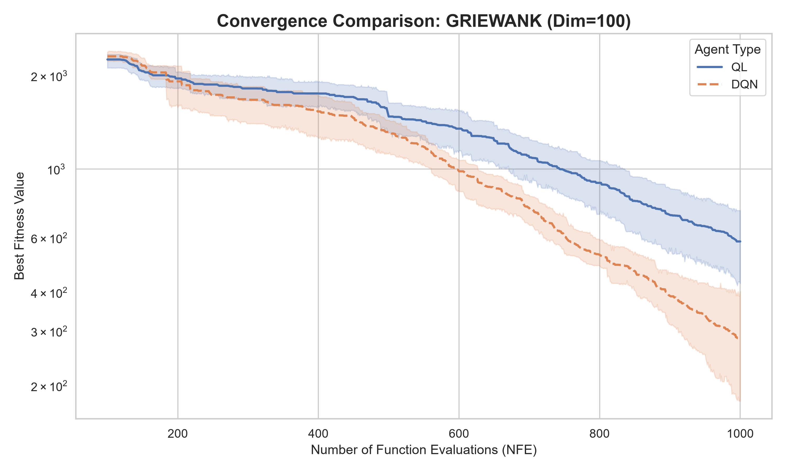 |
---

## 總結與未來展望 (Conclusion)

- **總結**：
本專案重現了 ESA 演算法，更針對其效能與狀態表示的侷限性進行了改良。
  1. **突破狀態空間限制**：成功導入 DQN 取代傳統的 Q-Table，解決了原先演算法只能處理離散且低維度狀態的痛點。我們精心設計了 8 維連續地形特徵，提供 Agent 更細緻的地形感知能力。
  2. **嚴謹的成效驗證**：透過完整的單一策略分析、消融實驗以及 Q-Learning 與 DQN 的數據對照，我們證實了深度強化學習在面對複雜、未知且昂貴的目標函數時，能有效提升 Agent 策略選擇的泛化能力與最終收斂表現。
- **未來展望**：
基於目前的實作成果，我們認為本專案仍有一些可進一步探討的發展方向：
  1. **持續改良強化學習架構**：目前的決策大腦基於 Value-based 的 DQN 演算法。未來可繼續改良輸入特徵、引入其他架構(如 PPO)，或近一步改良成 multi-agent。期望能在連續且更複雜的地形特徵輸入下，進一步提升訓練的穩定性與收斂速度。
  2. **拓展至工程實務應用**：除了標準的測試函數，希望能將此框架應用於真實世界的高昂最佳化問題。
    這個我們用到一半，時間不夠啦...

## References
*   **[Baseline]** Zhen, H., Gong, W., & Wang, L. (2023). Evolutionary sampling agent for expensive problems. *IEEE Transactions on Evolutionary Computation*, 27(3), 716-727.
*   **[DQN Extension]** Mnih, V., Kavukcuoglu, K., Silver, D., Graves, A., Antonoglou, I., Wierstra, D., & Riedmiller, M. (2013). Playing atari with deep reinforcement learning. *arXiv preprint arXiv:1312.5602*.
